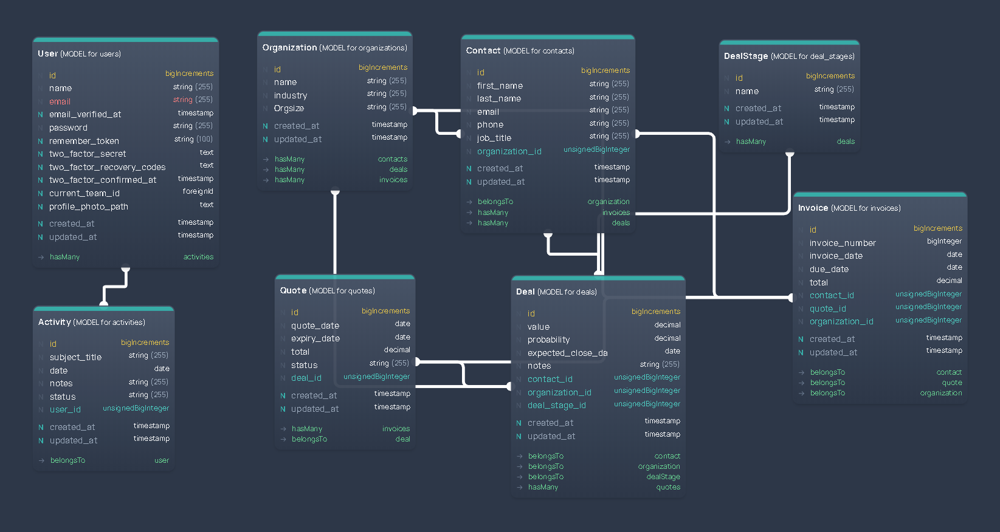

# Todist-CRM

Todist-CRM is a Customer Relationship Management (CRM) system built with Laravel and Laravel Filament.

## What is a CRM?

A Customer Relationship Management (CRM) system helps manage customer data. It supports sales management, delivers actionable insights, integrates with social media and facilitates team communication. Cloud-based CRM systems offer complete mobility and access to an ecosystem of bespoke apps.

This CRM, Todist-CRM, is designed to help you manage and analyze customer interactions and data throughout the customer lifecycle, with the goal of improving customer service relationships and assisting in customer retention and driving sales growth.

## Features

-   Customer management
-   Interaction tracking
-   Analytics and reporting
-   And more...

## Db Schema

